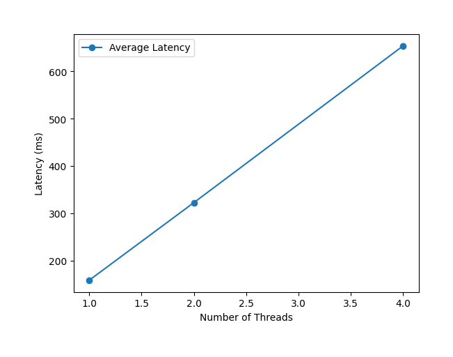

<h1 align="center"> Replicated Distributed Systems using Primary-Backup protocol </h1>

<!-- START doctoc generated TOC please keep comment here to allow auto update -->
<!-- DON'T EDIT THIS SECTION, INSTEAD RE-RUN doctoc TO UPDATE -->
# Table of Contents

- [About](#About)
- [Libraries](#Libraries)
- [Getting Started](#getting-started)
- [Class Structure](#class-structure)
- [Implementation](#implementation)
- [Evaluation](#evaluation)
- [Further Works](#further-works)

<!-- END doctoc generated TOC please keep comment here to allow auto update -->
<br>

# About

<i> Note: Distributed Systems - Multithreaded Factory is a console-based Server and Client Interface that was developed as part of the CS 7610 Foundation of Distributed Systems in Northeastern University.</i> 

This is a replicated distributed system that allows record update operation through the primary server, replicated to back up server nodes. Read operation is supported both by primary server and backup server.

<br>

# Libraries
```
No external libraries other than C++11 Standard Library was used for the program.
```
<br>

# Getting Started
<i>Note: when running the program in the local environment set ip address as '127.0.0.1' and use port number between 10000 and 65536.</i>

1. Clone the repository:

    ```bash
    git clone [repository_url]
    ```
2. Build the executable:

    ```bash
    make
    ```
3. Start a server in one terminal:

    ```bash
    ./server [port num] [unique ID] [num peers] (repeat [ID] [IP] [port num]
    ```
4. Start a client in another terminal:

    ```bash
    # request_type 1: write request
    # request_type 2: read request (without debug)
    # request_type 3: read request (with debug)
    ./client [ip addr] [port num] [num customers] [num orders] [request_type]
    ```

5. Sample command line arguments to simulate 3 server nodes and 1 client node
    ```bash
    # from node1 run;
    ./server 12345 0 2 1 10.200.125.72 12345 2 10.200.125.73 12345

    # from node2 run;
    ./server 12345 1 2 0 10.200.125.71 12345 2 10.200.125.73 12345

    # from node3 run;
    ./server 12345 2 2 0 10.200.125.71 12345 1 10.200.125.72 12345

    # from node4 run;
    ./client 10.200.125.71 12345 4 40000 1

    ```
<br>

# Class Structure
```
Server
- ServerMain: main entrance to the server program
- ServerStub: interface that engineer classes use to interact with serversocket to send data
- ServerSocket: communication channel between client
- ServerEngineer: class that interacts with server stub to send messages remotely to clients
- ServerMetadata: stores metadata of the server including;
    - primary_id: primary server's unique id
    - last_index: last index of the log that was executed
    - commited_index: last committed index within the log vector
    - smr_log: vector of server replication logs
    - neighbors: server node instance that encapsulates server id, ip, port
    - primary_sockets: clientsocket instance that is used to communicate with the neighbors
    - customer_record: key-value mapping of the customer number and order number

Client
- ClientMain: main entrance to the client program
- ClientSocket: communication channel between server
- ClientStub: instance included in a client thread that acts as an interface with client socket for communication
- ClientTimer: timer used to measure the latency of the request

Common
- Messages: message that is sent between server and clients including;
    - CustomerInfo: customer_id, order_num, request_type 
    - LaptopInfo: customer_id, order_number, request_type, engineer_id, admin_id
    - CustomerRecord: customer_id, last_order
    - Identifier: identifier - 1; Replication request, and ACK for replication request / 2; Customer Request
    - ReplicationRequest: last_idx, committed_idx, primary_id, op_code, op_arg1, op_arg2
```
<br>

# Implementation

## Modification: Send the client leader info instead of follower rerouting request to the leader
In my raft implemetation, if the server is a follower and the request type is update, client opens a new socket to communicate directly with the leader. The decision was to accomodate with the factory implementation that the server who updates sends back the laptop information to the client. Instead of follower receiving the laptop information from the leader and sending back the laptop information to the server, I believe the modification improves the network performance. For this, I added one more layer of communication when the server and client initializes socket connection. Leader sends client whether the current server is a leader or follower, and client acts accordingly. 

## Detail: Server initialization buffer
When server starts, I gave each server 5 seconds to allow all other 4 servers to have opened.

## Reparing server failure
For the simplicity of the problem, the program assumes that repairing of the failed backup server is done by primary server. Despite some or all the backup servers' failure, primary server continue to process the client's requests and send replication message to the backup server that are running. When the next client's request, either read or update request, is sent to the primary server, primary server will try to connect with all the failed server nodes that is stored in the metadata object. For all the backup servers that are recovered, primary server will iteratively send all the Map operation stored in the log vector object, sequentially. 

<br>

# Evaluation
The experiment was conducted to understand performance changes based on the number of servers. Each experiment was conducted 3 times to smooth out the affect of external factors. 4 client threads were used for 40,000 write orders per customer.

## Latency Graph
<i>Unit: latency - microseconds</i>
### Experiment


Increase in the number of servers resulted in higher latency. We can visualize the trade off of reliability and latency through replicated servers.

<br>

# Further works
The program assumes that all the messages from primary server is sent to back up nodes sequentially based on the TCP protocol. It would be interesting to modify logic to allow handling message sent through UDP protocol. It would also be interesting if we can also allow primary server to send the repair message to the backup nodes when the server comes back up while the clients are sending the message to the primary node, and when the primary and backup nodes are constantly changing.