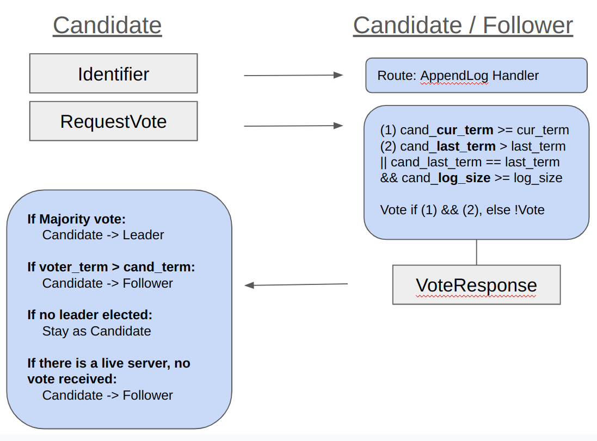
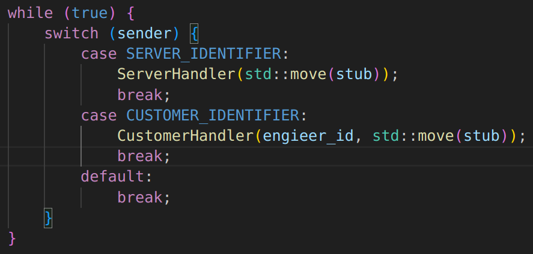
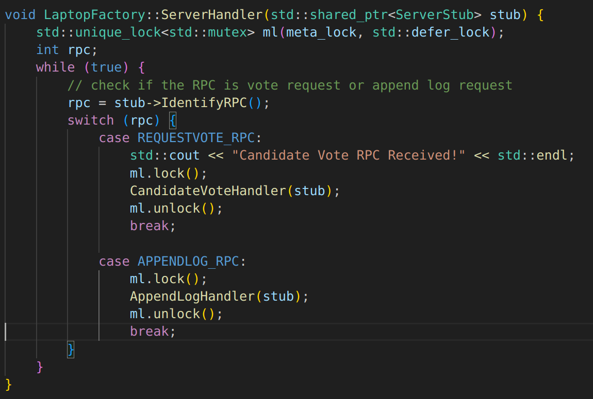
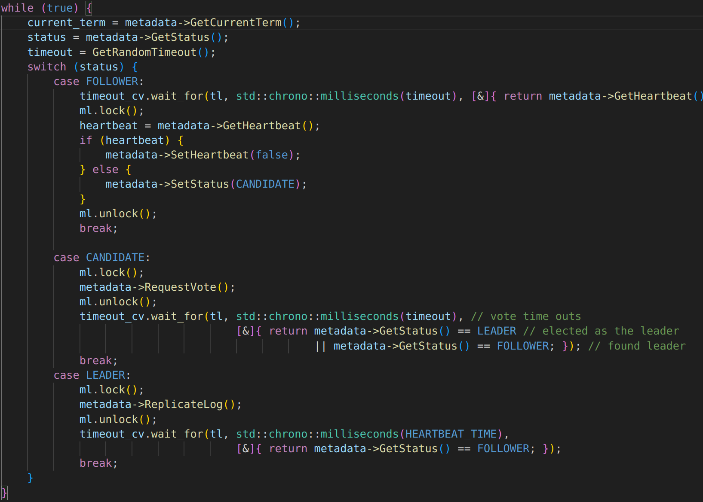
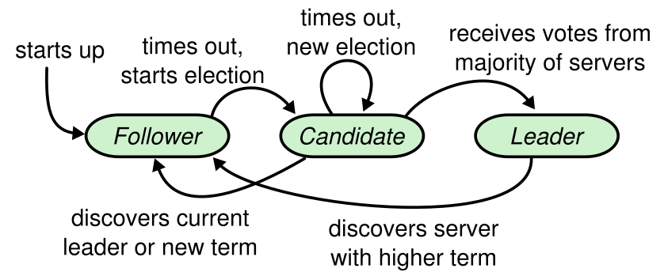

<h1 align="center"> Replicated Key-value system using Raft Consensus Algorithm </h1>

<!-- START doctoc generated TOC please keep comment here to allow auto update -->
<!-- DON'T EDIT THIS SECTION, INSTEAD RE-RUN doctoc TO UPDATE -->
# Table of Contents

- [About](#About)
- [Libraries](#Libraries)
- [Getting Started](#getting-started)
- [Class Structure](#class-structure)
- [Implementation](#implementation)
- [Evaluation](#evaluation)
- [Experiment](#experiment)
- [Further Optimization](#further-optimization)

<!-- END doctoc generated TOC please keep comment here to allow auto update -->
<br>

# About

This is a replicated distributed key-value storage system based on the Raft Consensus Algorithm. Clients can send read or update request to the servers. Read request can be handled by any servers(Leader, Candidate, Follower), but update request is only handled by the leader server node. Each order to the Leader is replicated across all the follower server nodes, and committed when majority of servers replicate the log.

<br>

# Libraries
```
No external libraries other than C++11 Standard Library was used for the program.
```
<br>

# Getting Started
<i>Note: when running the program in the local environment set ip address as '127.0.0.1' and use port number between 10000 and 65536.</i>

1. Clone the repository:

    ```bash
    git clone [repository_url]
    ```
2. Build the executable:

    ```bash
    make
    ```
3. Start a server in one terminal:

    ```bash
    ./server [port num] [unique ID] [num peers] (repeat [ID] [IP] [port num]
    ```
4. Start a client in another terminal:

    ```bash
    # request_type 1: write request
    # request_type 2: read request (without debug)
    # request_type 3: read request (with debug)
    ./client [ip addr] [port num] [num customers] [num orders] [request_type]
    ```

5. Sample command line arguments to simulate 3 server nodes and 1 client node
    ```bash
    # from node1 run; (server 1)
    ./server 12345 0 2 1 10.200.125.72 12345 2 10.200.125.73 12345

    # from node2 run; (server 2)
    ./server 12345 1 2 0 10.200.125.71 12345 2 10.200.125.73 12345

    # from node3 run; (server 3)
    ./server 12345 2 2 0 10.200.125.71 12345 1 10.200.125.72 12345

    # from node4 run; (client 1)
    ./client 10.200.125.71 12345 1 100 1

    ```
<br>

# Class Structure
```
Server
- ServerMain: main entrance to the server program
- ServerStub: interface that engineer classes use to interact with serversocket to send data
- ServerSocket: communication channel between client
- ServerEngineer: class that interacts with server stub to send messages remotely to clients
- ServerMetadata: stores metadata of the server including;
    - primary_id: primary server's unique id
    - last_index: last index of the log that was executed
    - commited_index: last committed index within the log vector
    - smr_log: vector of server replication logs
    - neighbors: server node instance that encapsulates server id, ip, port
    - primary_sockets: clientsocket instance that is used to communicate with the neighbors
    - customer_record: key-value mapping of the customer number and order number

Client
- ClientMain: main entrance to the client program
- ClientSocket: communication channel between server
- ClientStub: instance included in a client thread that acts as an interface with client socket for communication
- ClientTimer: timer used to measure the latency of the request

Common
- Messages: message that is sent between server and clients including;
    - CustomerRequest: customer_id, order_number, request_type
    - LaptopInfo: customer_id, order_number, request_type, engineer_id, admin_id
    - CustomerRecord: customer_id, last_order
    - Identifier: identifier (1 for Replication request and ACK for replication request, 2 for Customer Request)
    - ReplicationRequest: last_idx, committed_idx, leader_id, term, op_arg1, op_arg2
    - LeaderInfo: ip0, ip1, ip2, ip3, port
    - RequestVoteMessage: id, current_term, log_size, last_term
    - RequestVoteResponse: id, current_term, voted
    - LogRequest: leader_id, current_term, prefix_length, prefix_term, commit_length, op_term, op_arg1, op_arg2
    - LogResponse: follower_id, current_term, ack, success
```
<br>

# Implementation

## Raft Algorithm Overview
Main features of the system have been implemented based on the original <a src="https://raft.github.io/raft.pdf">Raft Paper</a> with some modifications. Each pre-configured server members are either Leader, Candidate or Follower. Under the condition when there is no network partition, there can only be a single leader, and a leader is elected through RequestVote RPC. Elected leader sends heartbeat every 100ms through AppendLog RPC. AppendLog RPC is used for leader for keeping its status as leader and replicate the logs.

## RequestVote RPC
(1) Candidate -> Other Servers: Identifier is sent from the Candidate to other servers. Server that receives the identifier will route to the RequestVote RPC Handler. 

(2) Candidate -> Other Servers: Request Vote Object is sent to the servers. 

(3) Other Servers -> Candidate: When the server receives the object, it creates the response with either vote or not vote; the receiving server will vote if cand_current_term >= cur_term of the receiving server and it is either the case that the last committed log in the candidate is bigger than the receiving server or is case the last committed log in the leader is same as the receiving server and the log_size of the candidate server. In other cases, receiving server will vote no.

(3) Candidate update state: When the candidate receives the response, if the current vote counts as the majority vote, it will change its state to the leader. If the voter's current term is bigger than the leader, candidate will demote itself as the follower. If no leader was elected, it will stay as the candidate. For optimization, if there is a live server and no vote is received, I demoted the server to a follower server.

|  |  |
|:--:|:--:|
| *Request Vote Object* | *Request Vote Response Object* |

## AppendLog RPC
(1) Leader -> Failed Servers: For all the failed servers, leader tries to reconnect to the server through TryReconnect method.

(2) Leader -> Other servers: Leader stores a data structure to keep track of the latest index of the log that was appended and committed at each server nodes. Sent number of log is represented as the prefix_length and if the prefix_length of the server node is the same, it sends an empty node as the heartbeat. Otherwise, sends the log information at prefix_length, along with last_term at the last log sent to the server.

(3) Other servers -> Leader: If the receiving server was a candidate or leader, and the current_term of the server is equal to or less than the leader's current term, it demotes to the follower. If the log_size of the receiver is bigger than or equal to the prefix_length saved in the leader, and the last log's prefix term is equal to the last term of the receiver, it can log. When the server can log, if the log size of the receiver is bigger than the prefix_length, it drops all the uncommitted log in the current receiving server. If the log request is not a simple heartbeat, it appends the log, and commits the log if the leader's last commited log is bigger than the receiving server's committed log. Lastly, it sends the append log success message along with the committed length. Otherwise, sends append failure message.

(4) Leader update state: If the leader's current term is smaller than the server that sent the Log Response, the leader will demote itself to the follower server. Otherwise, if the log response says success, it will update the sent_length, and ack_length datastructure accordingly.

## Adjustment of the original Raft Algorithm
* Heartbeat timeout interval: Instead of recommended use of 150ms ~ 300ms interval for heartbeat timeout, I decided to opt for 200ms ~ 300ms interval value. This decision was made to make sure unnecessary election does not happen due to network delay.

* Follower receiving update request: In my raft implemetation, if the server is a follower and the request type is update, client opens a new socket to communicate directly with the leader. The decision was made to accomodate with the factory implementation that the updating server sends back the laptop information to the client. Instead of follower receiving the laptop information from the leader and sending back the laptop information to the server, the modification improves the performance. For this, I added extra layer of communication when the server and client initializes socket connection. Leader sends client whether the current server is a leader or follower, and reroutes to the leader if the current server is not the leader.

* Number of nodes: 3 nodes were used for testing instead of 5, for testing convenience.

## Diagram of the algorithm
|  |  |
|:--:|:--:|
| *Request Vote RPC* | *Append Log RPC* |

## Server Routing
|  |  |
|:--:|:--:|
| *Identifier Handler* | *Server Handler* |

## Timeout Thread
|  |  |
|:--:|:--:|
| *TimeoutThread* | *State Machine* |

<br>

# Evaluation
- (1) When servers join, one of the server is elected as the Leader and other two stays as Follower.
    - As stated in the getting started, run 3 servers in a separate cluster. You should see one of the server with console printing "Set itself as the leader", while other two consoles are printing "Current term X: Follower", converged in the same "X" value
- (2) When all followers die, leader stays as leader and wait for other servers to join.
    - Try killing two terminals that are printing "Current term X: Follower". The leader program does not crash.
- (3) (Connected to (2)) Remaining leader should be able to process read request from the client.
    - Send a read request from a client by calling to the only surviving leader server "./client 10.200.125.73 12345 1 1 3"(assuming .73 is the leader and only live server). Assuming no update request was sent to the servers, client should not receive any customer_id to order_num mapping.
- (4) (Connected to (2)) Remaining leader should take the order from the client, but should not commit the log until at least one server(2 servers compose majority of the 3 total servers) joins.
    - Send an update request from a client to the only surviving leader server by calling "./client 10.200.125.73 12345 1 1 1" (assuming .73 is the leader and only live server), and then read the last order number of the customer by sending a read request from the client; "./client 10.200.125.73 12345 1 1 3". It should not have the record for the customer.
- (5) When one or all of the followers server fails and rejoins, logs are recovered by the leader.
    - When all the servers are alive, send the update request to the leader by calling "./client 10.200.125.73 12345 1 10 1"(assuming 73 was the leader). After the operation is finished, kill two follower servers. (wait until the socket is available, if applicable) Restart both the killed servers. After the replication was recovered(when the replication is recovered, the follower should start printing out "Current term X: Follower" message), send read request on each servers by calling "./client 10.200.125.71 12345 1 1 3", "./client 10.200.125.72 12345 1 1 3", "./client 10.200.125.73 12345 1 1 3". It should equally say customer_id: 0, order_num: 9.
- (6) (Connected to (5)) When failed follower rejoins, and the follower dies again while the logs are being replicated from the leader. If the follower joins again after the second failure, leader server should not break and send the log replication starting from the first log to the end to the recovered servers.
    - Do the same from the (5), and before the part that says "After the replication was recovered", kill the follower server again. Now, do the same stated in (5) and it should have the same expected outcome of (5).
- (7) When leader fails, remaining server should elect a new leader.
    - Given that there were a leader and two followers, if the leader is killed, one of the follower server should be elected as the leader. That leader server should print "Set itself as the leader!".
- (8) Newly elected leader should have the same capablility with the initial leader.
    - Testing (2), (3), (4), (5), (6) to the new server should work as expected.
- (9) Update request from client to the follower should be handled by the leader.
    - Try sending an update request to the non-leader server. If the leader is .73, send update request to .72 with "./client 10.200.125.72 12345 1 10 1". After the operation is done, send read request on each server by calling "./client 10.200.125.71 12345 1 1 3", "./client 10.200.125.72 12345 1 1 3", "./client 10.200.125.73 12345 1 1 3" on each respective server. It should equally say customer_id: 0, order_num: 9.
- (10) All followers should receive heartbeat every 200ms ~ 300ms
    - "Current term X: Follower" should constantly be printed in all the follower servers.


# Experiment
<i>Note: All experiment was conducted without any debug statement.</i> The experiment was conducted to understand performance changes based on the number of threads created by the client. Each experiment was conducted 3 times to smooth out the affect of external factors. For x number of threads, 1000 write orders were sent to the leader server.

## Latency Graph
<i>Unit: latency - miliseconds</i>
### Experiment


We can visualize the latency increase as we increase the number of threads created by the client. One thing I have noticed is that it seems like a single replication message is sent in a single window of the heartbeat instead of multiple messages sent within that timeframe, which may be causing high latency. The slope of the linear graph is around 160ms/thread, which is not far off from the interval heartbeat is sent from leader to the followers. Also, if a single order is sent, the latency is within the range of 3000 us, which indicates additional replication results in the suboptimal performance. This may be due to an implementation error, and needs to be remedied.

<br>

# Further optimization
- Modular design for Raft Algorithm
- Batching a single client request into a single log: Current implementation receives an order from the client, and sends AppendLog RPC for each of the laptop that was created for the client. Instead, for the optimization, leader can send a single log that contains the order detail and update the record based on the preconfigured logic of creating a new laptop.
- Optimize usage of locks: Performance may be not optimized due to overusage of locks.
- Add persistent memory for each server: In case more than half of the server dies, consensus may get reverted. In order to prevent this, persistent memory for each server is required.
- Membership change: For the current design, server starts with the pre configured membership of other server information. This may not scale well, when other server may join and the current server may leave.
- Develop analytical model to simulate, and test edge cases: there are lots of edge cases that I was not able to test, especially network partition.
- Include solution for corner cases including, leader failure while the customer order is being sent